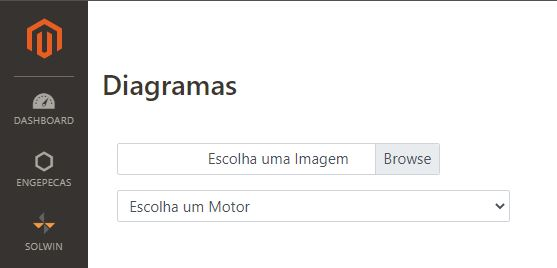
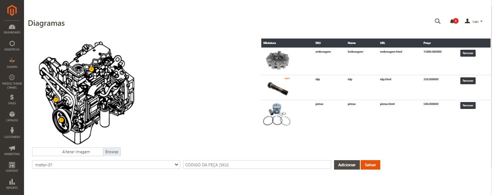
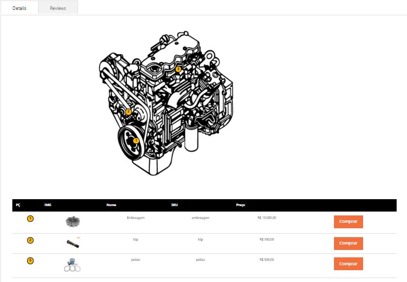

# Mage2 Module Engepecas Diagramas

    ``engepecas/module-diagramas``

 - [Main Functionalities](#markdown-header-main-functionalities)
 - [Installation](#markdown-header-installation)
 - [Configuration](#markdown-header-configuration)
 - [Specifications](#markdown-header-specifications)
 - [Attributes](#markdown-header-attributes)

## Main Functionalities
Criação de diagramas

## Installation
\* = in production please use the `--keep-generated` option

### Type 1: Zip file

 - Unzip the zip file in `app/code/Engepecas`
 - Enable the module by running `php bin/magento module:enable Engepecas_Diagramas`
 - Apply database updates by running `php bin/magento setup:upgrade`\*
 - Flush the cache by running `php bin/magento cache:flush`

### Type 2: Composer

 - Make the module available in a composer repository for example:
    - private repository `repo.magento.com`
    - public repository `packagist.org`
    - public github repository as vcs
 - Add the composer repository to the configuration by running `composer config repositories.repo.magento.com composer https://repo.magento.com/`
 - Install the module composer by running `composer require engepecas/module-diagramas`
 - enable the module by running `php bin/magento module:enable Engepecas_Diagramas`
 - apply database updates by running `php bin/magento setup:upgrade`\*
 - Flush the cache by running `php bin/magento cache:flush`

## Configuration

### Escolha um Motor

### Selecione as peças no motor (*a cada peça selecionada deve-se clicar em adicionar*)

### Visualização na loja

## Specifications

 - Block
    - Adminhtml/Index/Index
    - Index/Index
 - Controller
	- Adminhtml/Index/index
    - Adminhtml/upload/upload
    - Index/Index
 - View
    - adminhtml/layout/diagramas_index_index
    - adminhtml/templates/index
    - frontend/layout/diagramas_index_index
    - frontend/templates/index

## Attributes

